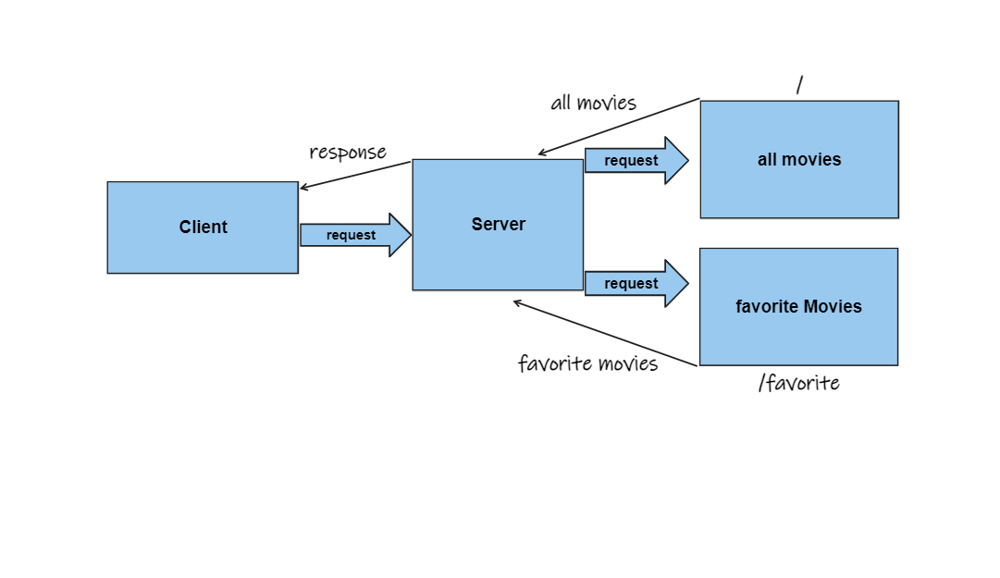

# -Movies-Library - Project 1.0.0

**Mohamad Abdeen**: Add your name here

## WRRC

## Overview

## to run this app in your machine you need to first run :(npm i) to install the packages and then run :(nodemon server.js)

## this api lets you find movies based on thier name and lets you find favorite movies also
