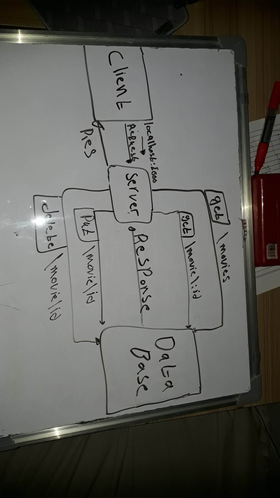

# -Movies-Library - Project 1.4.0

**Mohamad Abdeen**:

## WRRC

## lab 14 image handwriting

.

## Overview

### Project Features

#### this api lets you find trending movies worldwide and also lets you find similar movies to what you want and also find reviews for a specific movie and also lets you search and get movies based on its name

### in lab 14 i added the ability to get a movie by its id and also change its comments and delete it from the data base

## adding database

### connected the api with postgres database and added two more routes which are a post request to add a movie and a get request to get all the movies

## getting started

### to run this app in your machine you need to first run :(npm i) to install the packages , and to add to data base you need to first start the database on ur machine then run the schemas file to create the table u can do that by running the dburl in the enviroment file then type -f and the name of the file which is (schemas.sql) and then run :(nodemon server.js) to start the server
