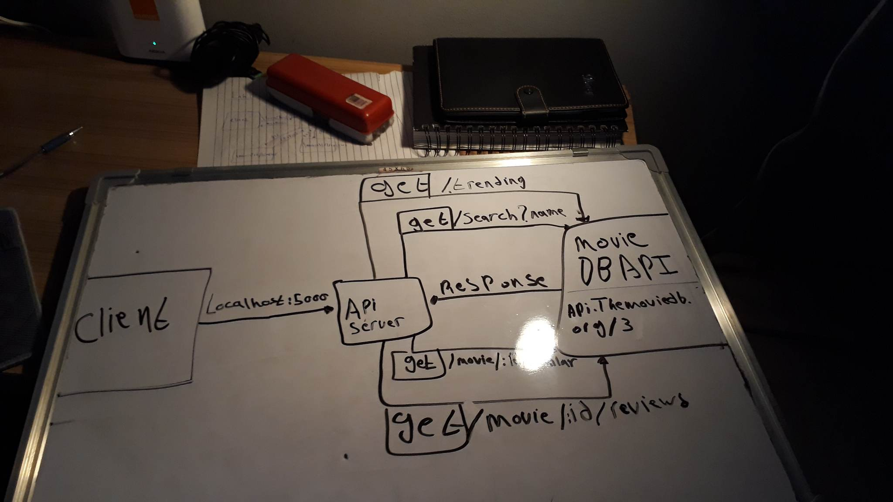

# -Movies-Library - Project 1.0.0

**Mohamad Abdeen**:

## WRRC

## Overview

### Project Features

#### this api lets you find trending movies worldwide and also lets you find similar movies to what you want and also find reviews for a specific movie and also lets you search and get movies based on its name

## getting started

### to run this app in your machine you need to first run :(npm i) to install the packages and then run :(nodemon server.js)

