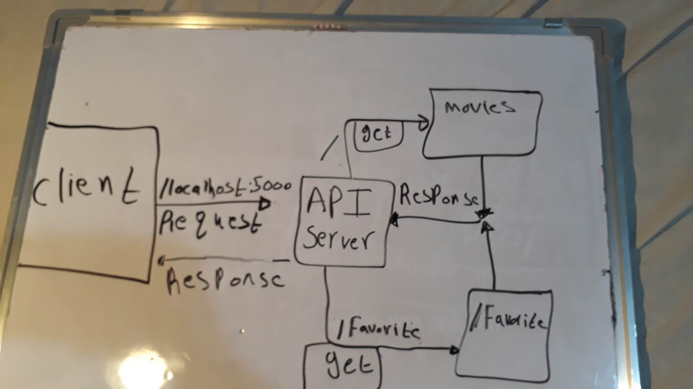

# -Movies-Library - Project 1.0.0

**Mohamad Abdeen**:

## WRRC

## Overview

### Project Features

#### this api return a movie with title and a posterpath and an overview of it and also there is a favorite page which is a working proccess to return your favorite movies

## getting started

### to run this app in your machine you need to first run :(npm i) to install the packages and then run :(nodemon server.js)
